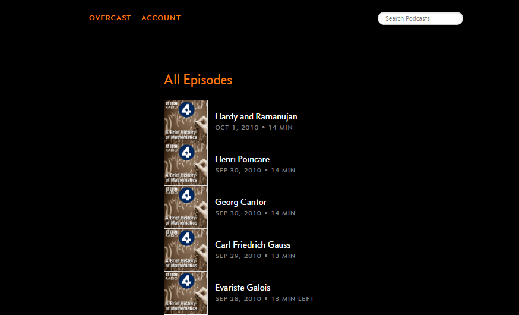
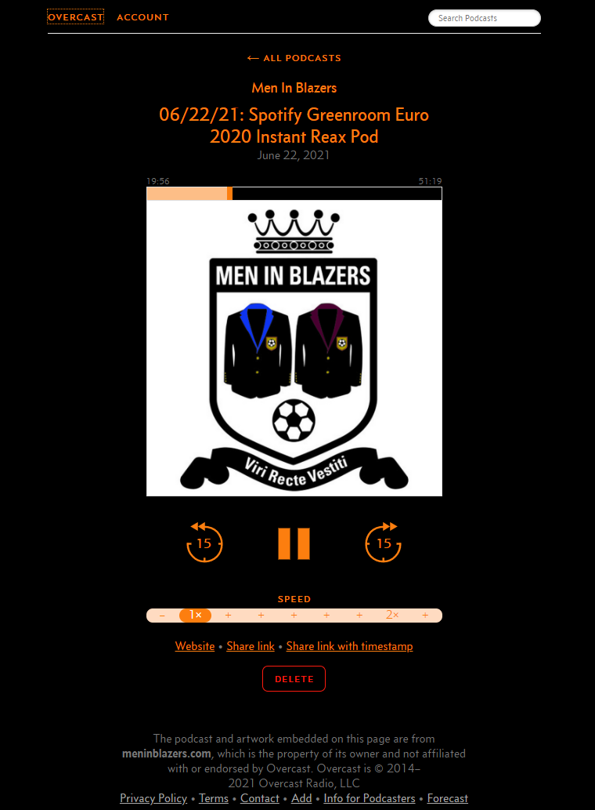

Title: Simple dark mode for Overcast on desktop
Date: 2021-06-22 13:27
Modified: 2021-06-22 13:27
Category: Hax
Tags: CSS, dark mode
Slug: overcast-dark-mode
Authors: Vibhav Gaur 
Blurb: A simple modification to make the Overcast desktop website have a dark theme.
PageType: BlogEntry

[Overcast](https://overcast.fm/) is the best podcast app out there. It sucks for Android users because its only available on iPhone, iPad, and Apple watch. But it has a web interfact which runs on any browser. Seriously, its great, so check it out. 

I like to have everything on my screen have a dark theme, I am not sure why everything doesn't at least offer a dark theme. This is a quick post about how you can make the Overcast desktop website have a dark mode. Its a very simple CSS injection and I did it in Chrome, but it should be a fairly similar process for other browsers. You will need an extension for your browser that lets you inject some CSS or JavaScript when your browser loads a website -- like [Page Manipulator](https://github.com/Ruud14/Page-Manipulator) for Chrome. You can look up similar extensions for your browser.

Once you have a way of injecting some CSS into a webpage, simply inject the following CSS when you load the Overcast website:

	:::CSS
	body{
	color: #fc7e0f;
	background-color: black;
	}

	.episodecell{
	color: white;
	}

	.feedcell{
	color: white;
	}

	.userdeletedepisode{
	color: white;
	}

I just looked at the HTML for the Overcast website and made a note of the elements whose colors would need to be changed. The code above is simply changing the colors of the background to black and changing the text for all the important stuff to white -- pick whatever colors you like, I like black and white. And I've used the same orange/pumpkin color for the headings in the body; looks pretty good imo.

	

	

