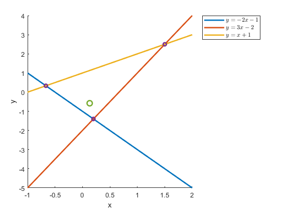
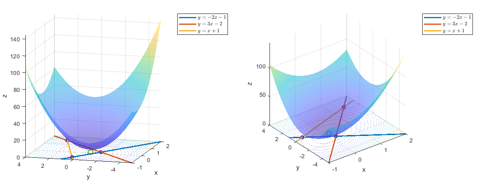
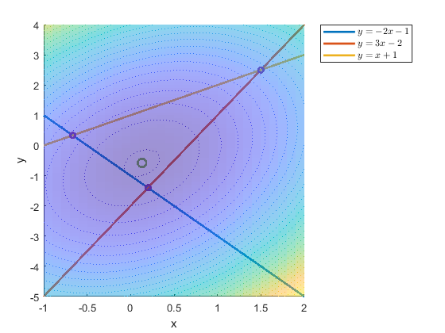

Title: Least squares applied to an overdetermined system
Date: 2021-09-06 22:46
Modified: 2021-09-06 22:46
Category: TeachNLearn
Tags: Math, Least squares
Slug: lsq-visualized-overdetermined
Authors: Vibhav Gaur
Blurb: Visually understanding what the least squares solution to an overdetermined system means.
PageType: BlogEntry

An [overdetermined system](https://en.wikipedia.org/wiki/Overdetermined_system) of equations is one where there are more equations than unknown variables.
This type of system almost always has no solution, except for a couple of special cases.
Let's say that we have the following overdetermined system of linear equations

$$ 
y = -2x - 1\\
y = 3x - 2\\
y = x + 1
$$

This system is overdetermined (or over-*constrained*) because we have 2 unknown variables -- $x$ and $y$, but we have 3 equations in $x$ and $y$.
This system can be rewritten in matrix form as follows (note that the bold $\mathbf{x}$ is a vector and is different from the light typeface $x$, which is the independent variable in this system of equations):

$$ A \mathbf{x} = \mathbf{b}\\
\text{where } A = \begin{bmatrix} 2 & 1\\ -3 & 1\\ -1 & 1 \end{bmatrix} \text{, } \mathbf{b} = \begin{bmatrix} -1\\ -2\\ 1 \end{bmatrix} \text{, and }
\mathbf{x} = \begin{bmatrix} x\\ y \end{bmatrix}
$$

Now, MATLAB gives us the least squares solution to this overdetermined system very easily using the following

	#!matlab
	A = [2,1;-3,1;-1,1]; b = [-1;-2;1];
	A\b

`ans = `  
`0.1316`  
`0.5789`

Let's take a visual *look* at what is going on here.
If we plot the lines represented by the system of equations, this is what we get:

The green dot in the middle represents the least squares solution.
As is clear from the picture above, this system has no solution that satisfies all 3 equations simultaneously.
The best we can do is get "close" to the lines in some sense -- that manner of "closeness" is what decides where the least squares solution will end up.
The manner of "closeness" is some kind of distance, and the generalized mathematical term for distance is a **norm**.
As it turns out, the least squares solution to every overdetermined system will reduce to the minimization of a norm.

By default, the norm that is used for least squares problem is the $l^2$-norm, which, in common parlance is known as the length of a vector from the origin.
The $l^2$-norm of a vector $x$ is defined as follows:

$$ ||x|| = \sqrt{x_1^2 + x_2^2 + \dots + x_n^2} \text{, where } x = \begin{bmatrix}x_1\\ x_2\\ \vdots\\ x_n \end{bmatrix} $$

The $l^2$-norm that we want to minimize in the least squares problem is $||A\mathbf{x}-\mathbf{b}||$.
Let's think about what that means.
Writing $A \mathbf{x} - \mathbf{b} = 0$ is the same as writing each equation in the linear system in the form of $ax + by + c = 0$.
For any value of $\mathbf{x} = [x',y']^T$, the expression $A \mathbf{x} - \mathbf{b}$ will be a vector.
The contents of the vector will be how much $c$ would need to change by for each equation such that the point $(x', y')$ satisfies each of the 3 lines.
Let's work it out for one of the lines and confirm:

$$ \text{Let } (x',y') = (0,0) \text{ and plug it into } y + 2x + 1 \implies (0) + 2 (0) + 1 = 1$$

So, if we subtract 1 from the first equation, the point $(0,0)$ would lie on the line described by the resulting equation.
If we minimize this norm for the system, we are effectively finding $\mathbf{x}$ such that the entire system would have to be moved the least amount to be satisfied by the point $\mathbf{x}$.

I calculated the $l^2$-norm for this system at a grid of points on the xy-plane and plotted the value of the norm on the z-axis.
This is the surface that resulted.
Full disclosure -- I calculated the square of the norm, but minimizing the square of the norm is the same as minimizing the norm itself in this case.

If you have access to MATLAB, you can download the .fig file [here](./documents/OverdeterminedVisualized/LeastSquaresVisualized.fig) and interact with the figure to understand it better.

You can see the lines in the system on the xy-plane, along with the least squares solution.
Though they are not very clear in this 3-D view, you may also be able to see the contour lines for this surface projected on the xy-plane.
A keen eye might already see the connection between the norm surface and the least squares solution, but the relationship will be clear once we view this scene from the top down.

The least squares solution is exactly the point that minimizes the norm.
The lowest point of the norm is that very point!
If you don't believe me, you can use calculus to get to the same result.
The (square of the) norm is given by

$$ \Phi(x,y) = (y + 2x + 1)^2 + (y - 3x + 2)^2 + (y - x - 1)^2 $$

Find the partial derivatives of this expression, and calculate the minimum of this function.
You will get the same exact point.

### Experiment with other systems and the code (requires MATLAB/Octave)

The following MATLAB code was used to make the plots shown above.
This was written in MATLAB R2021a, but it should work directly in any newer version.
I have not tested this with Octave, but I don't think it should be difficult to get it working there either.

	#!matlab
	A = [2,1;-3,1;-1,1], b = [-1;-2;1]

	% creating parametric equations for the lines in the system
	fx = @(x) x; fz = @(x) 0;
	eq1 = @(x) -2.*x - 1, eq2 = @(x) 3.*x - 2, eq3 = @(x) x + 1

	% calculating the intersection points for each pair of lines in the system (for plotting later)
	int12 = A(1:2,:)\b(1:2);
	int13 = [A(1,:);A(3,:)]\[b(1);b(3)];
	int23 = A(2:3,:)\b(2:3);
	intx = [int12(1);int23(1);int13(1)];
	inty = [int12(2);int23(2);int13(2)];
	A\b	% least squares solution

	% creating the xy grid and the norm function
	[Xgrid, Ygrid] = meshgrid(linspace(min(intx), max(intx),50), linspace(min(inty), max(inty),50));
	dfun = @(x,y) ((y+2*x+1).^2) + ((y-3*x+2).^2) + ((y-x-1).^2);
	[cX, cY] = meshgrid(-1:0.1:2,-5:0.1:4);

	% Least squares solution
	x0 = 0.1316;
	y0 = -0.5789;

	% remove a vectorization warning that MATLAB will give
	warning('off','MATLAB:fplot:NotVectorized');

	% creating the plots
	plotInterval = [-1 2];
	figure;
	sc = surfc(cX, cY, dfun(cX,cY));	% plot the surface
	sc(2).LevelStep = 5; sc(2).LineStyle = ':';	% appearance properties for the surface
	sc(1).FaceAlpha = 0.5; sc(1).LineStyle = 'none';
	hold on;
	e1 = fplot3(fx, eq1, fz, plotInterval,'LineWidth',2);	% plot the lines
	e2 = fplot3(fx, eq2, fz, plotInterval,'LineWidth',2);
	e3 = fplot3(fx, eq3, fz, plotInterval,'LineWidth',2);

	plot([int12(1);int23(1);int13(1)],[int12(2);int23(2);int13(2)],'o','MarkerSize',5,'LineWidth',2);	% plot the intersection points
	plot(x0,y0,'o','MarkerSize',8,'LineWidth',2);	% plot the least squares solution
	% text(x0, y0, sprintf("Norm: %.4f\nSum of dist: %.4f",norm([x0;y0]),dfun(x0, y0)),'Position',[x0 + 0.1 y0]); hold off;	% label for point
	xlabel('x'); ylabel('y'); zlabel('z');
	legend([e1, e2, e3],"$y=-2x-1$","$y=3x-2$","$y=x+1$",'interpreter','latex','Location','bestoutside')
	view(2); grid on;

	% turning the warning back on
	warning('on','MATLAB:fplot:NotVectorized');

