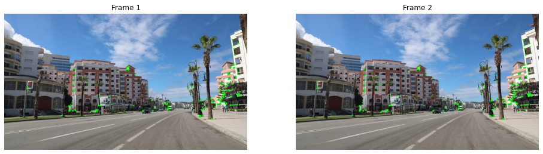
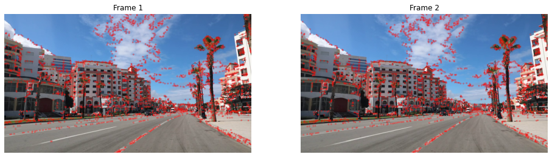
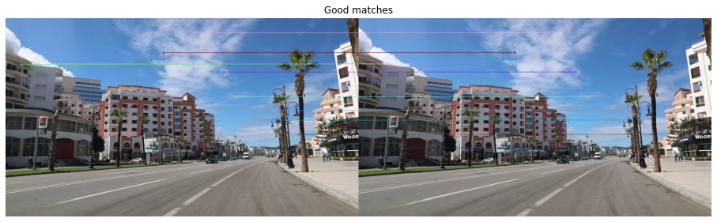
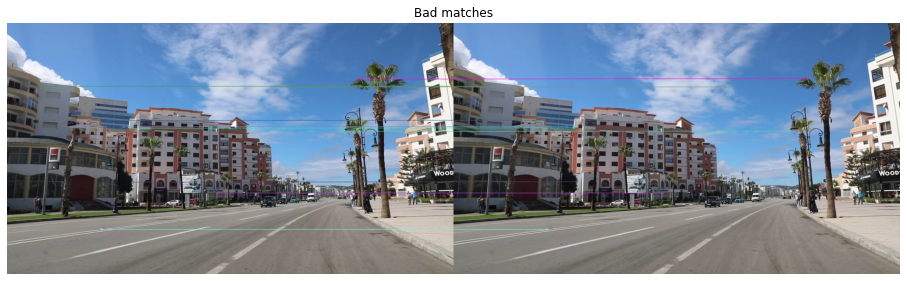
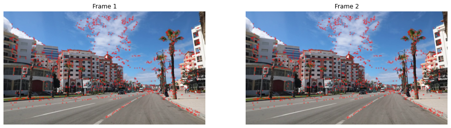

Title: Visual Odometry (Part 2)
Date: 2021-08-29 19:40
Modified: 2021-08-29 19:40
Tags: Computer Vision
Slug: visodo-2
Authors: Vibhav Gaur
Blurb: Feature detection and matching -- this time done correctly.
PageType: BlogEntry

**This post is second in a series on Visual Odometry. Find part 1 [here](../visodo-1.html).**

Ok, the last time around we got stuck because:

* we were not detecting enough features
* the feature matches that we found were not great

Shown below is where we were at -- using the ORB detector's default `detect` method did not lead to a lot of good features. 
Additionally, the matches weren't great with large Hamming distances in the "worse" matches.

	#!python
	detector = cv2.ORB_create()
	kp1, kp2 = detector.detect(frame1, None), detector.detect(frame2, None)
	print("Number of keypoints: ", len(kp1)," and ", len(kp2))
	# kp1, des1 = detector.compute(frame1, kp1)
	# kp2, des2 = detector.compute(frame2, kp2)
	# print("Descriptors: ", des1.shape, des2.shape)

	frame1_kp = cv2.drawKeypoints(frame1, kp1, None, color=(0,255,0), flags=0)
	frame2_kp = cv2.drawKeypoints(frame2, kp2, None, color=(0,255,0), flags=0)
	showImages(frame1_kp, frame2_kp)

`Number of keypoints:  500  and  500`  

### Feature (re-) detection

Another way to get features is to first find nice corners in the frame and then using ORB to figure out descriptors for those specific corners. 
If we can choose nice robust corner features, it will be easier to track them between frames. 
Thankfully, openCV has a function for this - `goodFeaturesToTrack`.

Below, we first find the good features from both frames and convert them the to `KeyPoint` type to work with other openCV functions.
The results are good!
We have 3000 corners with the same corners being detected in both frames, so we can be hopeful for the feature matching step.

	#!python
	goodFeats1 = cv2.goodFeaturesToTrack(np.mean(frame1, axis = 2, dtype = np.uint8), maxCorners = 3000, qualityLevel = 0.01, minDistance = 3)
	goodFeats2 = cv2.goodFeaturesToTrack(np.mean(frame2, axis = 2, dtype = np.uint8), maxCorners = 3000, qualityLevel = 0.01, minDistance = 3)

	# convert corners to keypoint type
	kp1 = [cv2.KeyPoint(x = f[0][0], y = f[0][1], size = 20) for f in goodFeats1]
	kp2 = [cv2.KeyPoint(x = f[0][0], y = f[0][1], size = 20) for f in goodFeats2]

	frame1_gkp = cv2.drawKeypoints(frame1, kp1, None, color=(255,0,0), flags=0)
	frame2_gkp = cv2.drawKeypoints(frame2, kp2, None, color=(255,0,0), flags=0)
	showImages(frame1_gkp, frame2_gkp)

### Feature (re-) matching

We can now compute ORB descriptors here (remember that `detector` is an ORB object).
Then, we can use the brute-force matcher to find matches between the two frames, however this time we will use the k-nearest neighbors algorithm.
The default `match()` method of the `BFMatcher` object returns the best match, while the `knnMatch()` method returns the *k* best matches.
This will be useful to do some processing to distinguish good matches from bad ones using [Lowe's ratio test](https://stackoverflow.com/a/60343973/3186279).

	#!python
	# computing descriptors
	kp1, des1 = detector.compute(frame1, kp1)
	kp2, des2 = detector.compute(frame2, kp2)
	# finding knn matches
	matcher = cv2.BFMatcher(cv2.NORM_HAMMING)#, crossCheck = True)
	matches = matcher.knnMatch(des1, des2, k = 2)
	# applying ratio test
	goodMatches = [m for m, n in matches if m.distance < 0.75*n.distance]
	# print(goodMatches)

	framesMatched = cv2.drawMatchesKnn(frame1, kp1, frame2, kp2, [goodMatches[:10]], None, flags = cv2.DrawMatchesFlags_NOT_DRAW_SINGLE_POINTS)
	plt.figure(figsize = [16,16]), plt.axis('off'), plt.title("Good matches"), plt.imshow(framesMatched), plt.show();

Displaying the first 10 matches, we can see they look pretty good.
Even the bad matches look pretty good!

	#!python
	framesBadMatches = cv2.drawMatchesKnn(frame1, kp1, frame2, kp2, [goodMatches[-10:]], None, flags = cv2.DrawMatchesFlags_NOT_DRAW_SINGLE_POINTS)
	plt.figure(figsize = [16,16]), plt.axis('off'), plt.title("Bad matches"), plt.imshow(framesBadMatches), plt.show();

These matches will still be pretty noisy if I were to detect them across all frames in the video, so we need to somehow enforce the perspective projection/projective geometry model on them.
This can be done by using the Fundamental Matrix.

#### Filtering bad matches using the Fundamental Matrix

The **[fundamental matrix](https://en.wikipedia.org/wiki/Fundamental_matrix_(computer_vision))** $F$ is a matrix that maps points in one image to their matches in the other image (I'm not fully sure, but this is typically done in a stereo setting -- however a single moving camera is approximately a stereo camera that is not moving, as long as the frame rate is high enough compared to the camera motion).
Ok, technically it doesn't match points to points, but points to their respective epipolar lines.
Due to the [epipolar constraint](https://en.wikipedia.org/wiki/Epipolar_geometry#Epipolar_constraint_and_triangulation), it is guaranteed that a point in one image plane will have its match in the other (stereo) image frame on a line (called the epipolar line).
This is really cool, because now when we search for a match, we just need to search a line in the image instead of the whole 2-D image.
This constraint restricts our search space by a lot!
Here, we will use this fact in a reverse way.
We already have the matches, thanks to our brute-force matcher -- albeit not all of them are high quality as we saw above.
And we know (actually, we assume) that the matches must satisfy the epipolar constraint, which is basically saying that they must follow the mapping (or transformation) of the fundamental matrix.
Now, we can tell by looking at each match if it is a good quality match or not, but this constraint gives us a quantitative way of deciding whether a match is a good match or not.
So, the points that don't obey this fundamental matrix transform (or mapping) are bad matches.

There is an algorithm that fits the best model with specified structure to noisy data, called [RANSAC](https://en.wikipedia.org/wiki/Random_sample_consensus), which can help us check which mapping satisfies most of our data.
RANSAC stands for Random Sample Consensus.
While that may sound fancy, the algorithm itself is fairly common sense.
RANSAC takes a *random sample* of data and fits a model to it.
It keeps repeating this process until it fits a model that represents most of the data well enough (according to some pre-specified parameters).
This is the mathematical equivalent of forming an opinion on a topic by asking a bunch of people what they think is right, and then going with whatever most people said is right.
All things considered, its not a terrible way to form opinions.
We will use this to filter out bad matches.

	#!python
	ransacData = np.array([(kp1[m.queryIdx].pt, kp2[m.trainIdx].pt) for m in goodMatches])
	model, inliers = ransac((ransacData[:,0], ransacData[:,1]), FundamentalMatrixTransform, min_samples=8, residual_threshold=1, max_trials=2000)
	print("Fundamental Matrix:\n", model.params)

`Fundamental Matrix:`  
` [[ 3.64257554e-09  6.53331526e-06 -3.25147208e-03]`  
` [-6.53220141e-06 -1.25524925e-08  6.15791865e-03]`  
` [ 3.24476011e-03 -6.12805433e-03 -9.17567059e-03]]`  

	#!python
	kp1 = [cv2.KeyPoint(x = m[0][0], y = m[0][1], size = 20) for m in ransacData[inliers]]
	kp2 = [cv2.KeyPoint(x = m[1][0], y = m[1][1], size = 20) for m in ransacData[inliers]]

	frame1_gkp = cv2.drawKeypoints(frame1, kp1, None, color=(255,0,0), flags=0)
	frame2_gkp = cv2.drawKeypoints(frame2, kp2, None, color=(255,0,0), flags=0)
	showImages(frame1_gkp, frame2_gkp)

Above, we can see the keypoints in both frames that best satisfy the epipolar constraint as enforced by the fundamental matrix.

I'm gonna call it here for this post.
This is where we should've been after the first post, but we're exploring here.
In the next post we will talk about estimating the pose of the camera -- it will be math heavy.
See you [there](../visodo-3.html).

### References

* [First Principles of Computer Vision](https://www.youtube.com/channel/UCf0WB91t8Ky6AuYcQV0CcLw) YouTube channel
* [twitchslam](https://github.com/geohot/twitchslam) by George Hotz
* [KITTI Odometry with OpenCV Python](https://www.youtube.com/playlist?list=PLrHDCRerOaI9HfgZDbiEncG5dx7S3Nz6X) by Nate Cibik
* Visual Odometry by David Scaramuzza and Friedrich Fraundorfer
