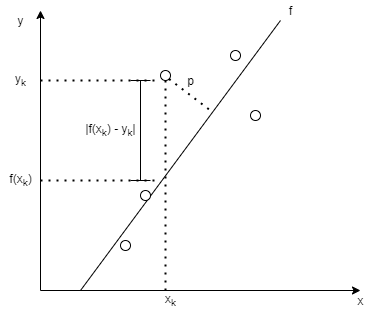

Title: Least-Squares fitting
Date: 2021-06-26 13:31
Modified: 2021-06-26 13:31
Slug: Least-squares
PageType: ProjectDescription

The method of Least-Squares is an intuitive mathematical approach to fitting a curve (or surface, or hypersurface) to a set of data. 
For a 1-dimensional data set, each data point has an $x$ coordinate and a $y$ coordinate -- since we need one additional dimension to visualize the output, but this can be expanded to as many dimensions as needed.
So, an example data set can be
$$ (x_1, y_1), (x_2, y_2), \dots, (x_n, y_n) $$

### Linear least squares
If we wanted to fit a line through the above data, we would effectively be saying that we want to approximate the data set by the function

$$ y = f(x) = Ax + B $$

where the "fitting" process is the process of finding $A$ and $B$ given some constraint -- in this case some kind of error minimization constraint.
This error constraint can be defined in a variety of ways, for example:

* Average error: $E_{avg}(f) = \frac{1}{n} \sum_{k=1}^n |f(x_k) - y_k|$. This is just averaging the errors between each prediction and corresponding data point.
* Root-mean-square error: $E_{rms}(f) = \sqrt{ \frac{1}{n} \sum_{k=1}^n |f(x_k) - y_k|^2}$. Anytime there is a root-mean-square value anywhere, its calculated by performing those operations in the reverse order.
Take the error, square it, calculate its mean, and then square root it -- voila, the *root-mean-square* value of the error.
This is the most popular constraint on the error used in practice.
For reasons that will be clear shortly ahead, using simply the mean-square error is also popular in practice and will be used for the following discussion.

As mentioned previously, "fitting" means finding the parameters $A$ and $B$ of the "curve" (in this case a line) such that $E_{rms}$ is minimized.
This calls for some calculus, specifically, setting the derivative of $E_{rms}$ to $0$ with respect to the parameters $A$ and $B$.

$$ \frac{\partial{E_{rms}}}{\partial A} = 0 \text{ and } \frac{\partial E_{rms}}{\partial B} = 0 $$

Minimizing $E_{rms} = \sqrt{ \frac{1}{n} \sum_{k=1}^n |f(x_k) - y_k|^2}$ is the same as minimizing the square of this quantity, so we write

$$ E_{rms} = \sum_{k=1}^{n} |f(x_k) - y_k|^2 = \sum_{k=1}^{n} (Ax_k + B - y_k)^2 $$

To minimize this with respect to $A$ and $B$ we calculated the partial derivatives and set them to $0$:

\begin{align}
\frac{\partial E_{rms}}{\partial A} = \sum_{k=1}^{n} 2(Ax_k + B - y_k) x_k = 0	\\
\frac{\partial E_{rms}}{\partial B} = \sum_{k=1}^{n} 2(Ax_k + B - y_k) = 0
\end{align}

The above is a linear system of equations in $A$ and $B$:

$$ \begin{bmatrix}
	\sum_{k=1}^{n} x_k^2 & \sum_{k=1}^{n} x_k \\
	\sum_{k=1}^{n} x_k   & \sum_{k=1}^{n}
   \end{bmatrix} \begin{bmatrix}
			A \\
			B
		 \end{bmatrix} = \begin{bmatrix}
		 			\sum_{k=1}^{n} x_k y_k \\
					\sum_{k=1}^{n} y_k
				\end{bmatrix}
$$

This system of linear equations is easily solved by many available software packages like NumPy or MATLAB.

A different type of curve can be fit just as easily by including the additional parameters in the resultant linear system.
For example, to fit a second degree polynomial would go something like this:

$$ y = f(x) = Ax^2 + Bx + C $$

which has 3 parameters, $A$, $B$, and $C$.
This (quadratic) curve could be fit to the data using the same methods outlined above.
This would result in a linear system of equations generated by setting the partial derivatives to $0$

$$ \frac{\partial E_{rms}}{\partial A} = 0 \text{, } \frac{\partial E_{rms}}{\partial B} = 0 \text{, } \frac{\partial E_{rms}}{\partial C} = 0 $$

#### Spatial inuition for a least squares fit
To develop some spatial intuition about least squares fitting, consider the 1-dimensional data case where the data is given by

$$ (x_1, y_1), (x_2, y_2), \dots, (x_n, y_n) $$

Let's consider what is going when when we minimize the RMS error for this data set by considering just one data point.
This is best described in the following picture:

When one minimizes the error (or some form of it) for a given data point $(x_k, y_k)$, marked on the above picture as $|f(x_k) - y_k|$, one is actually parameterizing the line that overall has the least distance (along the *y*-direction) from *all* the data points (since the error is summed for all data points). 
One may define the error as the perpendicular distance of the data points from the fit line, in which case the distance *p* would be minimized for each data point.
One can take this intuition to higher dimensions where, in the linear fit case, one is fitting a plane (or hyperplane with appropriate dimensionality) to the data set.
The definition of the error will determine which "distance" is being minimized.
In nonlinear fitting, the curve being fit generalizes to a hypersurface of appropriate dimensionality.

### Nonlinear least squares
The system of equations generated by the minimization problem above is not always a linear system.
If the function (curve) used to fit the data is a nonlinear function of the paramters, then it is likely going to result in a nonlinear set of equations.
If you don't believe me, then try to get the system of equations formed when one tries to fit the function $y = f(x) = e^{Ax}$ to the data.
Such a system cannot be easily solved using analytical methods which we have been using above.
In fact, a solution may not even exist.
Or many solutions may exist.
Such a system can be solved using an iterative numerical procedure like [Newton-Raphson](https://en.wikipedia.org/wiki/Newton%27s_method).
In general, fitting a function of $M (M < n)$ parameters $y = f(x, C_1, C_2, \dots, C_M)$ to the data will generate a system of nonlinear equations which will have to solved numerically.

### References:
*[Data-Driven Modeling and Scientific Computation: Methods for Complex Systems and Big Data](https://www.amazon.com/Data-Driven-Modeling-Scientific-Computation-Methods/dp/0199660344)* by [Nathan Kutz](http://faculty.washington.edu/kutz/)

For any questions regarding this post, reach out to me using one of the methods below.
