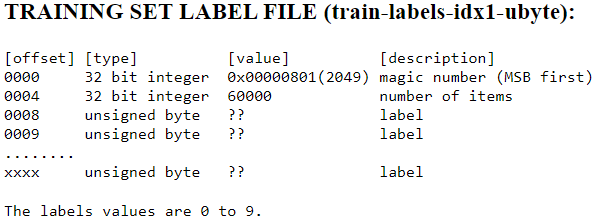

Title: Decoding the MNIST data set images
Date: 2021-06-16 23:16
Modified: 2021-06-16 23:16
Slug: MNISTDecoder
PageType: ProjectDescription

**Incomplete Blogpost**

I have recently been trying to learn about neural networks by implementing a classifier for the [MNIST data set](http://yann.lecun.com/exdb/mnist/).
One of the challenges that I faced to get started was to decode the data set.
The data is divided up into 4 files, which are listed at the top of the website for the dataset:

* Training set images: `train-images-idx3-ubyte.gz` 
* Training set labels: `train-label-idx1-ubyte.gz` 
* Test set images: `t10k-images-idx3-ubyte.gz` 
* Test set labels: `t10k-labels-idx3-ubyte.gz` 

The files are available from the website in compressed form (.gz), but these are easily unzipped on UNIX systems using `gunzip`.
On Windows, the `Expand-Archive` powershell utility does not support .gz files (_big surprise!_).
I have git bash installed, so I was still able to use `gunzip` through that (or, get the expanded versions from my [GitHub](https://github.com/vibhavgaur/NeuralNetworkPractice) repo for this project in the "`MNISTData`" folder).
These files are stored in a simple format directly in the form of the bytes that represent the image data and label data.
They can be "decoded" by simply reading the bytes as a stream of information from the files.
This can be done with any utility that lets you read a file in as a series of bytes.

According to the description of the files on the website, the image files have a few things at the top (or beginning) of the bytestream before reaching the image pixel data.

The first 4 bytes are a 32 bit `int` "magic number". 
I'm not fully sure what a magic number is supposed to do, but it has a significance in computer science.
The following 4 bytes are another 32 bit `int` which holds the number of images in the file (60,000 in this case).
The next 4 bytes contain the number of rows, followed by another 4 bytes which contain the number of columns.
These signify the size of the images.
In the case of the MNIST data set, the images are `28 x 28` pixels.
So after the first 15 bytes, the 16th byte onwards contains pixel data -- 1 pixel value per byte as a grayscale intensity value between 0 and 255.
Here's how this can be done in python: 

	:::python
	f = open(images_file, 'rb')
	images = []
	
	# decoding the header of the file -- these are all 32 bit integers coded in these bytes
	magicWord_32bit = f.read(4) # read the first 4 bytes (8*4 = 32 bits) -- the magic word
	n_images_32bit = f.read(4)  # number of images
	n_rows_32bit = f.read(4)    # number of rows in each image
	n_cols_32bit = f.read(4)    # number of columns in each image
	
	# convert to integers (subscript [0] because struct.unpack always returns a tuple)
	magicWord = struct.unpack('>i', magicWord_32bit)[0]
	n_images = struct.unpack('>i', n_images_32bit)[0]
	n_rows = struct.unpack('>i', n_rows_32bit)[0]
	n_cols = struct.unpack('>i', n_cols_32bit)[0]
	
	# Read the entire file as a stream of bytes
	# The innermost for loop chops off the bytestream at the end of each column of the image
	# The middle for loop chops off the bytestream at the end of each row of the image
	# The outermost for loop chops off the bytestream at the end of each image
	try:
	    for i in range(n_images):
	        image = []
	        for r in range(n_rows):
	            for c in range(n_cols):
	                byte = f.read(1)
	                pixel = struct.unpack('B', byte)[0]
	                image.append(pixel)
	        images.append(image)
	finally:
	    f.close()
	    return images

A similar strategy can be followed for the labels, with a slightly different header at the beginning of the bytestream.

Note that for the label files, we have the first 4 bytes with the 32 bit `int` "magic number".
In the next 4 bytes we have another 32 bit `int` that stores the number of items (in this case labels, 60,000 of them).
Then, from the 8th byte onwards we have 1 label per byte, with label values going from 0 to 9.
This can be read using the following code in python:

#!python
