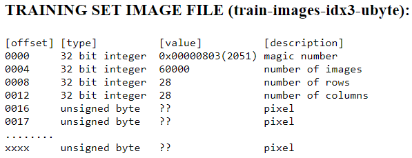

Title: Decoding the MNIST data set images
Date: 2021-06-16 23:16
Modified: 2021-06-16 23:16
Slug: MNISTDecoder
PageType: ProjectDescription

**Incomplete Blogpost**

I have recently been trying to learn about neural networks by implementing a classifier for the [MNIST data set](http://yann.lecun.com/exdb/mnist/).
One of the challenges that I faced to get started was to decode the data set.
The data is divided up into 4 files, which are listed at the top of the website for the dataset:

* Training set images: `train-images-idx3-ubyte.gz` 
* Training set labels: `train-label-idx1-ubyte.gz` 
* Test set images: `t10k-images-idx3-ubyte.gz` 
* Test set labels: `t10k-labels-idx3-ubyte.gz` 

The files are available from the website in compressed form (.gz), but these are easily unzipped on UNIX systems using `gunzip`.
On Windows, the `Expand-Archive` powershell utility does not support .gz files (_big surprise!_).
I have git bash installed, so I was still able to use `gunzip` through that (or, get the expanded versions from my [GitHub](https://github.com/vibhavgaur/NeuralNetworkPractice) repo for this project in the "`MNISTData`" folder).
These files are stored in a simple format directly in the form of the bytes that represent the image data and label data.
They can be "decoded" by simply reading the bytes as a stream of information from the files.
This can be done with any utility that lets you read a file in as a series of bytes.
I have done so in python.

According to the description of the files on the website, the image have a few things at the top (or beginning) of the bytestream before reaching the image pixel data.

The first 4 bytes are a 32 bit `int` "magic number". 
The following 4 bytes are another 32 bit `int` which holds the number of images in the file.
The next 4 bytes contain the number of rows, followed by another 4 bytes which contain the number of columns.
These signify the size of the images.
In the case of the MNIST data set, the images are `28 x 28` pixels.
So after the first 15 bytes, the 16th byte onwards contains pixel data -- 1 pixel value per byte as a grayscale intensity value between 0 and 255.
This can be done in python 

	#!python
	import numpy as np
	thing = []

To insert code into markdown -- [https://python-markdown.github.io/extensions/fenced_code_blocks/#syntax-highlighting](https://python-markdown.github.io/extensions/fenced_code_blocks/#syntax-highlighting)

To highlight syntax using markdown extension -- [https://python-markdown.github.io/extensions/code_hilite/](https://python-markdown.github.io/extensions/code_hilite/)
